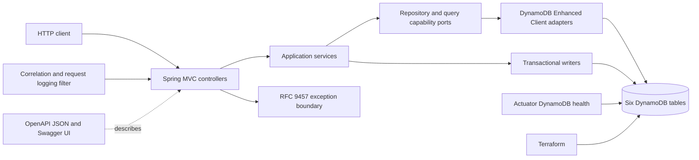
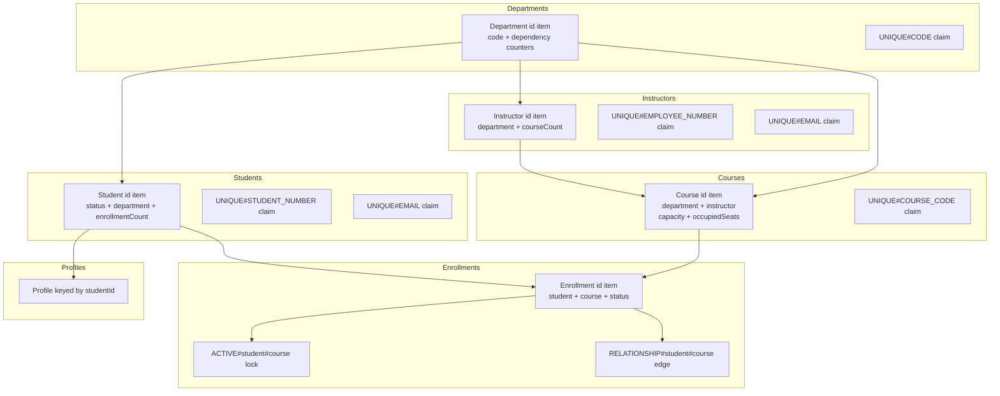
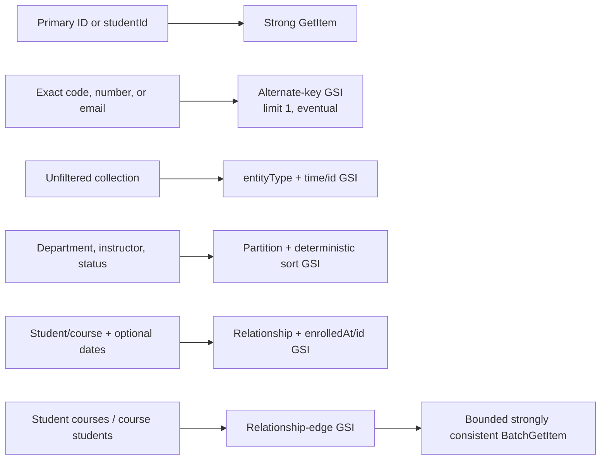

# DynamoDB application architecture

## Scope

The DynamoDB datasource is the first complete persistence implementation of the Student Portal API. It uses six source
tables so the later PostgreSQL migration exercises heterogeneous tables and explicit relationship reconstruction rather
than translating a synthetic single-table model.

## Application architecture



Controllers depend on application services for commands and primary/exact reads. DynamoDB-specific collection capability
ports expose only bounded access patterns supported by table keys. Persistence records are explicit Enhanced Client
beans; domain records do not contain DynamoDB annotations.

There are no JPA-style entity mappings because DynamoDB has no persistence context, dirty checking, lazy relationships,
join columns, or foreign-key engine. Adapters explicitly map domain values to physical attributes and transaction writers
state every condition and cross-table mutation.

## Physical item layout



Claim, lock, and relationship-edge records are typed internal items. Sparse attributes keep them out of logical catalog
GSIs. Parent dependency counters make delete/create races authoritative without relying on eventually consistent indexes.

## Main access paths



`Query` is used for application collections. `Scan` is reserved for future offline migration and reconciliation jobs.
Exact alternate-key GSIs are read conveniences, while deterministic transaction claims enforce uniqueness. The API
rejects unknown filters, unsupported combinations, arbitrary sort requests, offsets, and totals.

## Cursor pagination

Every collection accepts a bounded `limit` and optional opaque cursor. The cursor encodes the typed
`LastEvaluatedKey` plus an identity for the physical table, index, partition, normalized prefix, and date range. It is
URL-safe and versioned. Reuse against another query or malformed data produces a `400 invalid-request` response. Exact
alternate-key reads return the same envelope with zero or one item, `limit: 1`, and no cursor.

DynamoDB does not calculate PostgreSQL-style exact totals or arbitrary page offsets efficiently. Fetching page N requires
the continuation key from page N-1; this is an explicit API difference, not hidden scanning.

## Transactional enrollment flow

```mermaid
sequenceDiagram
    participant API as Enrollment service
    participant S as Students table
    participant C as Courses table
    participant E as Enrollments table
    API->>S: Condition active; increment enrollmentCount/version
    API->>C: Condition open and capacity; increment counters/version
    API->>E: Conditional Put enrollment
    API->>E: Put durable relationship edge
    API->>E: Conditional Put active-pair lock
    Note over S,E: One TransactWriteItems request; all commit or all roll back
    E-->>API: duplicate lock / stale condition / capacity cancellation
    API-->>API: translate to 409 conflict
```

Status transitions condition on the Enrollment version, adjust occupied capacity when necessary, and create or remove
the owned active lock in the same transaction. Dropping is a state transition; history is not physically deleted.

## Consistency and relationship integrity

- Primary-key validation and ownership reads are strongly consistent.
- GSIs are eventually consistent and never decide uniqueness or destructive dependency safety.
- Alternate-key uniqueness uses deterministic claim items in the entity table transaction.
- Department, Instructor, Student, and Course dependency/enrollment counters participate in child create/move/delete
  transactions. Concurrent parent deletion and child creation contend on the same parent item.
- Durable Student/Course edges provide deduplicated derived views across re-enrollment.

## Provisioning and runtime boundary

Terraform owns all six tables, keys, GSIs, billing mode, and tags. Application startup never creates infrastructure.
The `local-dynamodb` profile supplies an explicit LocalStack endpoint and dummy credentials; tests use their own
LocalStack Testcontainer and mirrored schema assertions. `/actuator/health` checks all six table statuses. Startup logs
contain profiles, region, endpoint host, and table names but no credentials or tokens.

## Migration impact

Migration to PostgreSQL must scan each table independently with a per-table checkpoint, discard internal claims/locks as
relational implementation details, convert durable edges and foreign-key attributes into relationships, preserve IDs and
versions, recompute or validate counters, and load in referential order. Cursor tokens are datasource-specific and cannot
be carried across the switch.
