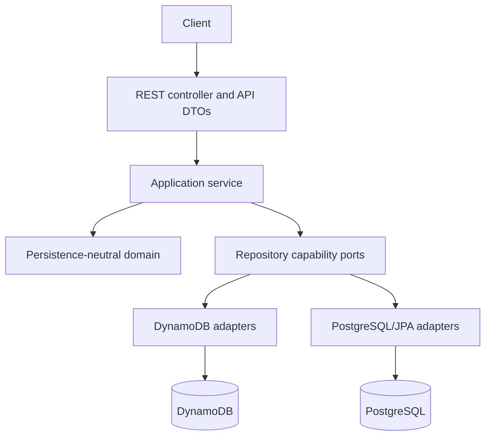

# Architecture overview

The application uses package-by-feature with explicit layers. Business behavior stays stable while persistence capabilities remain visible.

Controllers validate transport input and delegate. Application services coordinate business rules, relationship checks, and transaction use cases. Domain types enforce local invariants. Adapters translate domain objects to database-specific records and errors.

Repository abstractions cover genuinely common business operations. DynamoDB cursor queries, PostgreSQL pageable queries, migration source reads, and migration target writes use capability-specific interfaces. This prevents inefficient or impossible behavior from being disguised as portability.

The planned top-level Java packages are `common`, `department`, `student`, `instructor`, `course`, `enrollment`, and `migration`. Each feature may contain `api`, `application`, `domain`, and `persistence` packages as needed. Profile behavior is owned by the student feature.

The Phase 1 code establishes `domain` records, immutable nested API request/response records, explicit API mappers,
filter objects, and repository ports. Repository ports intentionally omit list pagination: DynamoDB cursor queries and
PostgreSQL pageable queries will be introduced as separate capability interfaces after the DynamoDB access patterns
are designed. Controllers and application-service implementations follow when a complete use case can be wired;
the application is not populated with placeholder beans merely to make unfinished endpoints start.

Runtime profiles select explicit adapters:

- `local-dynamodb` and `test-dynamodb`
- `local-postgres` and `test-postgres`
- `migration`, which intentionally connects source and target

Phase 0 has no persistence profile. Profile-specific beans will be configured explicitly to avoid ambiguous injection.

## Key decisions

- REST DTOs, domain models, DynamoDB records, and JPA entities are separate.
- Enrollment is an explicit association entity.
- Database-specific pagination is exposed honestly.
- Enrollment concurrency is implemented and tested separately for each database.
- Flyway, not Hibernate schema generation, owns the relational schema.
- Infrastructure is provisioned externally; application startup will not create DynamoDB tables.
