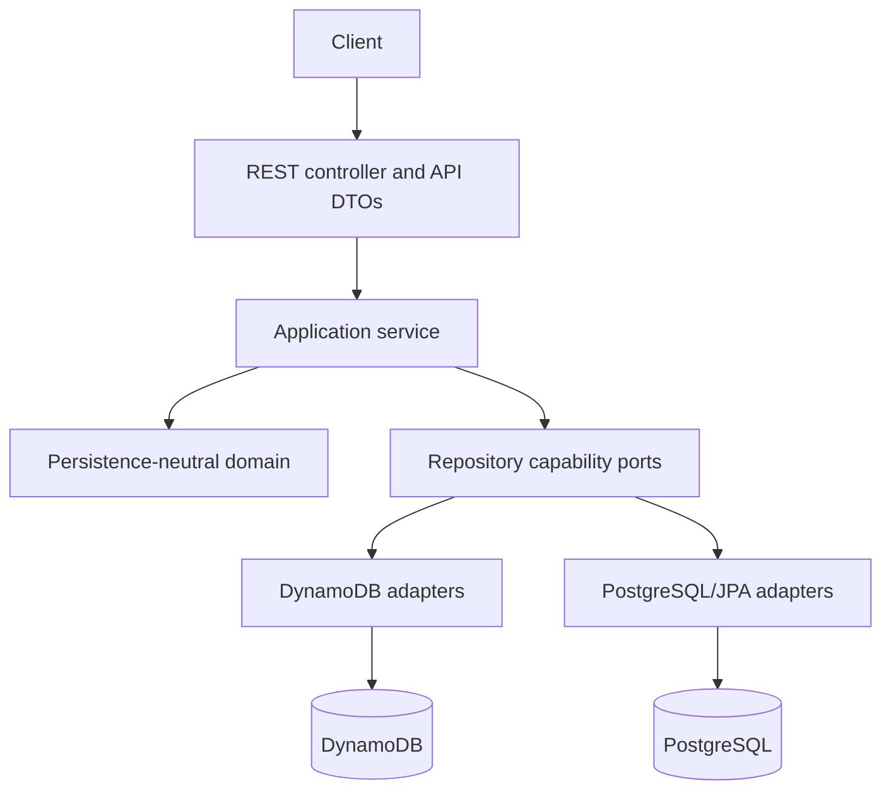

# Architecture overview

The application uses package-by-feature with explicit layers. Business behavior stays stable while persistence capabilities remain visible.

Controllers validate transport input and delegate. Application services coordinate business rules, relationship checks, and transaction use cases. Domain types enforce local invariants. Adapters translate domain objects to database-specific records and errors.

Repository abstractions cover genuinely common business operations. DynamoDB cursor queries, PostgreSQL pageable queries, migration source reads, and migration target writes use capability-specific interfaces. This prevents inefficient or impossible behavior from being disguised as portability.

The current top-level Java packages are `common`, `department`, `student`, `instructor`, `course`, and `enrollment`;
`migration` is reserved for the later migration phase. Each implemented feature contains `api`, `application`, `domain`,
and datasource-specific persistence packages. PostgreSQL entities, Spring Data repositories, port adapters, and
collection queries live together under each feature's `persistence/postgres` package. Only relational support that
genuinely spans domains—pagination/cursor support, shared audit identity, version checks, dependency checks, mapping,
and Student/Course composition—lives under `common/persistence/postgres`. Runtime profile configuration lives under
`common.configuration`.

The Phase 1 code establishes `domain` records, immutable nested API request/response records, explicit API mappers,
filter objects, and repository ports. Common repository ports intentionally omit list pagination. Datasource-neutral
query ports have DynamoDB cursor and PostgreSQL pageable implementations. DynamoDB-profile controllers and application services are implemented for all current
resources and relationship routes; the application contains no placeholder runtime beans.

Runtime profiles select explicit adapters:

- `local-dynamodb` and `test-dynamodb`
- `local-postgres` and `test-postgres`
- `migration`, which intentionally connects source and target

The default profile exposes the persistence-neutral application foundation and health endpoint. Profile-specific beans
are configured explicitly to avoid ambiguous injection.

## Key decisions

- REST DTOs, domain models, DynamoDB records, and JPA entities are separate.
- Enrollment is an explicit association entity.
- Database-specific pagination is exposed honestly.
- Enrollment concurrency is implemented and tested separately for each database.
- Flyway, not Hibernate schema generation, owns the relational schema.
- Infrastructure is provisioned externally; application startup will not create DynamoDB tables.
- DynamoDB uses six domain-oriented source tables so migration exercises cross-table references, ordering, checkpoints,
  and reconciliation representative of the reference project. This supersedes the initial single-table ADR.
