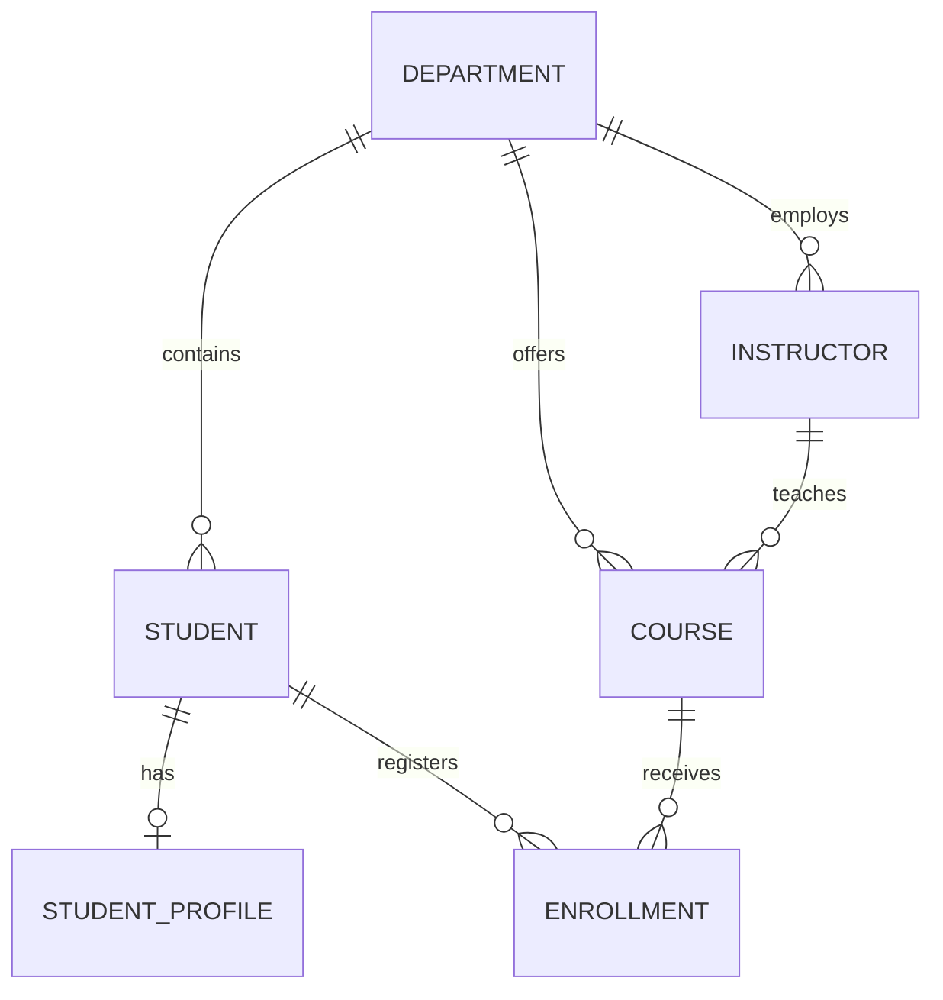

# Domain model

## Purpose

The domain model is persistence-neutral. API DTOs, DynamoDB items, and JPA entities are separate representations mapped at layer boundaries.

## Aggregates and identities

Every resource uses a UUID, `createdAt`, `updatedAt`, and a non-negative version. Domain timestamps use an injectable clock; PostgreSQL entity timestamps are managed by Hibernate (`@CreationTimestamp`/`@UpdateTimestamp`). Versions support conditional writes in DynamoDB and optimistic locking in PostgreSQL, but the domain does not contain database annotations.

- **Department**: unique uppercase code, name, and optional description.
- **Student**: unique student number and normalized unique email; belongs to one existing department.
- **StudentProfile**: optional one-to-one detail owned by a student; its `studentId` is unique.
- **Instructor**: unique employee number and normalized unique email; belongs to one existing department.
- **Course**: unique uppercase course code, positive credits and capacity; belongs to one department and has one primary instructor. The instructor must belong to the course's department.
- **Enrollment**: explicit Student–Course association with its own identity, lifecycle, timestamps, version, and optional final grade.

Cross-aggregate existence and uniqueness checks belong in application services because they require repository access. State transitions and field invariants belong in domain behavior. Persistence adapters provide atomicity and concurrency controls appropriate to each database.

## State transitions

Student status is `ACTIVE`, `INACTIVE`, `GRADUATED`, or `SUSPENDED`. New students are active unless a valid initial status is explicitly accepted. Only active students may create enrollments.

Course status transitions are deliberately constrained:

- `DRAFT` → `OPEN` or `CANCELLED`
- `OPEN` → `CLOSED`, `CANCELLED`, or `COMPLETED`
- `CLOSED` → `OPEN`, `CANCELLED`, or `COMPLETED`
- `CANCELLED` and `COMPLETED` are terminal

Enrollment status transitions are:

- `ENROLLED` → `DROPPED` or `COMPLETED`
- `WAITLISTED` → `ENROLLED` or `DROPPED`
- `DROPPED` and `COMPLETED` are terminal

Only an `OPEN` course accepts a new enrollment. `ENROLLED` and `COMPLETED` consume capacity; `WAITLISTED` and `DROPPED` do not. A final grade is allowed only for `COMPLETED`. Dropping records `droppedAt`; other states must not carry it.

An active enrollment means `ENROLLED` or `WAITLISTED`. A student cannot have more than one active enrollment for the same course. Capacity checks and enrollment creation form one atomic business operation.

## Deletion policy

- A student may be physically deleted only when it has no enrollment history; its profile is removed atomically with it.
- A profile may be physically deleted independently.
- A department, instructor, or course may be physically deleted only when no dependent records exist.
- Enrollment `DELETE` is interpreted as dropping an active enrollment, preserving registration history. Already terminal enrollments cannot be deleted.

These conservative policies work in both persistence models. DynamoDB uses relationship queries for preflight errors,
but authoritative Student/Course enrollment-history counters and Department/Instructor dependency counters enforce
deletion rules transactionally under concurrency. PostgreSQL will additionally use foreign keys and constraints.

## Capacity implementation

DynamoDB maintains authoritative Course occupied-seat and enrollment-history counters in cross-table transactions with
Enrollment state and active-pair locks. PostgreSQL will use a documented locking or atomic-update strategy. The public
rule remains identical: concurrent requests must never overbook a course.
